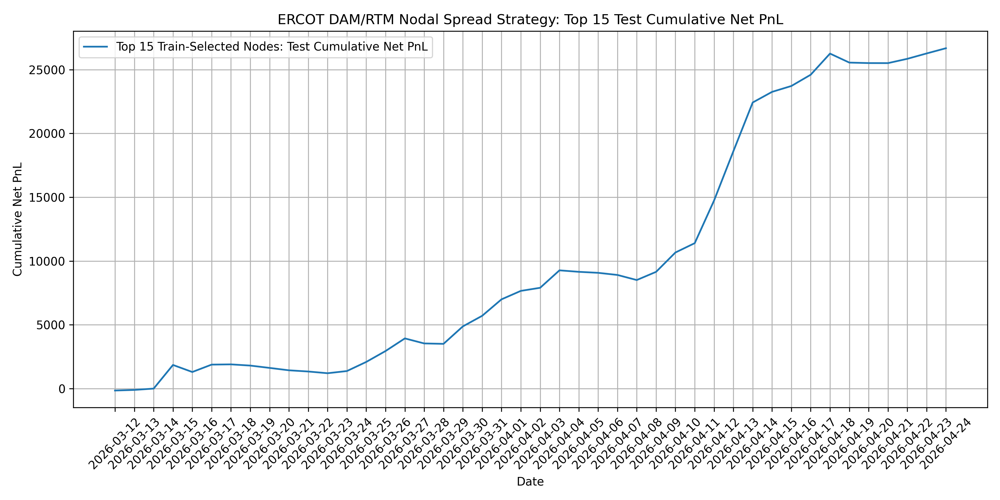
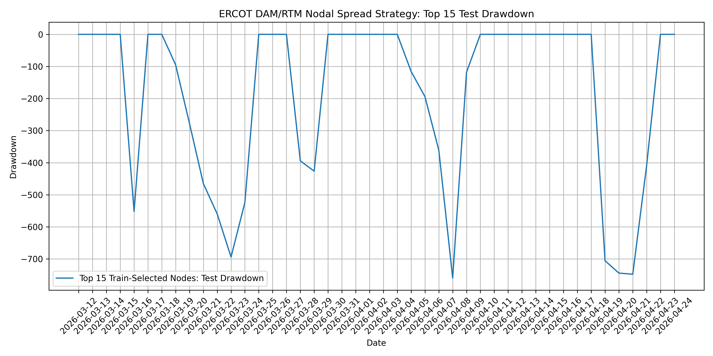

# ERCOT DAM/RTM Nodal Spread Strategy

## Overview

This project studies whether short-term ERCOT congestion patterns persist across the day-ahead and real-time markets.

I built a Python backtesting framework using ERCOT Day-Ahead Market (DAM) and Real-Time Market (RTM) LMP data. The strategy constructs hub-node spreads and tests whether prior-day same-hour RTM congestion can be used as an ex-ante signal for DAM-to-RTM spread trades.

## Research Question

Can prior-day same-hour RTM hub-node congestion predict profitable DAM-to-RTM nodal spread opportunities?

## Data

The project uses ERCOT public API data:

- RTM LMP endpoint: `/np6-788-cd/lmp_node_zone_hub`
- DAM hourly LMP endpoint: `/np4-183-cd/dam_hourly_lmp`

The core spread definition is:

```text
RTM_Spread = RTM_Hub_LMP - RTM_Node_LMP
DAM_Spread = DAM_Hub_LMP - DAM_Node_LMP
Alpha_PnL = RTM_Spread - DAM_Spread
Net_PnL = Alpha_PnL - transaction_cost

## Main Result: Train-Selected Top 15 Node Basket

The final strategy uses a 40-node high-coverage universe derived from 51 matched DAM/RTM pricing locations. Nodes were ranked using the training window only, then the top 15 train-selected nodes were evaluated out-of-sample on the test window.

**Official held-out test result:**

| Metric | Value |
|---|---:|
| Test trades | 2,548 |
| Net PnL | $26,677.30 |
| Mean trade PnL | $10.47 |
| Win rate | 66.8% |
| Annualized Sharpe | 9.25 |
| Max drawdown | -$759.61 |
| Test days | 44 |

The result suggests that prior-day same-hour RTM hub-node spread can help identify persistent congestion opportunities, but the effect is node-specific. A broad all-node basket performed poorly, while train-only node selection produced stronger out-of-sample performance.

### Train/Test Result Interpretation

The train-selected Top 15 basket performed better in the held-out test period than in the training period. I interpret this cautiously. The training window was used only to rank nodes with positive lagged-congestion behavior, while the test period appears to have contained stronger congestion opportunities in those same nodes.

Because ERCOT congestion is regime-dependent, this result should not be interpreted as proof of persistent production performance. It motivates additional walk-forward validation over longer samples and across multiple market regimes.

## Figures

### Cumulative Net PnL



[Open full-size cumulative PnL figure](https://github.com/SangamShrestha/ercot-nodal-spread-research/blob/main/figures/official_top15_test_cumulative_pnl.png)

### Drawdown



[Open full-size drawdown figure](https://github.com/SangamShrestha/ercot-nodal-spread-research/blob/main/figures/official_top15_test_drawdown.png)

## Future Work

This project is a research backtest, not a production trading system. The next improvements would focus on broader validation, richer market features, and more realistic execution assumptions:

- **Walk-forward validation:** Repeatedly train on one window and test on the next window to evaluate stability across time.
- **Weather, load, wind, and reserve features:** Add ERCOT system conditions to test whether congestion persistence is stronger during grid stress regimes.
- **Longer history:** Extend the backtest beyond the current sample to evaluate performance across more market regimes.
- **Improved RTM/DAM node mapping:** Expand beyond exact-name matches between RTM `SettlementPoint` and DAM `BusName`.
- **Random-node baseline:** Compare train-selected nodes against randomly selected matched-node baskets to test whether node selection adds real value.
- **Position sizing:** Move from equal-sized trades to volatility-adjusted or risk-budgeted sizing.